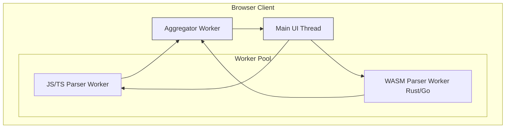

# DirAnalyze Cartographer

### The MRI for Your Codebase

**DirAnalyze Cartographer** is a high-performance, polyglot code visualization tool that runs entirely in your browser. Drop a project folder and get an instant, interactive "MRI" of its architecture, revealing hidden complexity, critical dependencies, and structural risks.

It's designed for developers, architects, and team leads who need to understand an unfamiliar codebase *before* making a critical change. It answers three questions faster than any IDE:
1.  **What's Dangerous?** (Where is the complex, tangled code?)
2.  **What's Connected?** (What is the "blast radius" of changing this file?)
3.  **What's Important?** (Which are the core, load-bearing files and functions?)

[](https://github.com/your-repo/diranalyze-cartographer)
[](https://opensource.org/licenses/MIT)
[](CONTRIBUTING.md)

  <!-- TODO: Replace with a real screenshot -->

---

## Core Features

*   **Polyglot Analysis Engine:** Parses multiple languages using native-speed WebAssembly parsers, providing deep insights beyond simple text matching.
*   **Complexity Heatmap:** Instantly identify high-risk files through a visual, color-coded map of cyclomatic complexity and code volume.
*   **Blast Radius Explorer:** Select any file to see an interactive graph of its dependents (what it will break) and dependencies (what it relies on).
*   **Symbol-Level Centrality:** Drill down into a file to see which of its exported functions are most critical, based on their usage count across the entire project.
*   **100% Client-Side & Secure:** Your code is never uploaded. All analysis happens locally in your browser sandbox. The tool is read-only by design.
*   **Zero-Install:** No setup required. Run it directly from its website or by opening `index.html` locally.

---

## Supported Languages

The analysis engine is built on a modular architecture using Tree-sitter and other native parsers compiled to WebAssembly.

| Language           | Parser              | File-Level Deps | Symbol-Level Deps | Complexity Metrics | Status      |
|:-------------------|:--------------------|:---------------:|:-----------------:|:------------------:|:------------|
| **JavaScript/TS**  | `acorn.js`          |       ✅        |        ✅         |         ✅         | **Stable**  |
| **Rust**           | `tree-sitter-rust`  |       ✅        |      *(WIP)*      |         ✅         | **Beta**    |
| **Go**             | `tree-sitter-go`    |       ✅        |      *(WIP)*      |         ✅         | **Beta**    |
| **Python**         | *Internal AST*      |       ✅        |        ✅         |       *(WIP)*      | **Alpha**   |
| **Swift**          | *SourceKitten*      |     *(Planned)*     |     *(Planned)*     |      *(Planned)*     | **Planned** |

---

## Architecture Overview

`diranalyze` uses a sophisticated, multi-tiered client-side architecture to ensure a responsive UI, even when analyzing large repositories.



1.  **Main UI Thread:** Manages only user interactions and rendering, ensuring the app never freezes.
2.  **Parser Workers:** A pool of Web Workers handles the CPU-intensive task of parsing files. JavaScript files are handled by `acorn.js`, while other languages like Rust and Go have their native Tree-sitter parsers compiled to WebAssembly for near-native performance.
3.  **Aggregator Worker:** A dedicated worker receives processed data from all parser workers and is responsible for the complex task of stitching together the global dependency graph. This prevents the main thread from becoming a bottleneck.

---

## Getting Started

### Using the Live Version

The easiest way to use `diranalyze` is via the official hosted version:
[**[your-github-username].github.io/diranalyze-cartographer/**](https://[your-github-username].github.io/diranalyze-cartographer/)

### Running Locally

1.  Clone the repository:
    ```bash
    git clone https://github.com/your-repo/diranalyze-cartographer.git
    cd diranalyze-cartographer
    ```
2.  Install development dependencies:
    ```bash
    npm install
    ```
3.  Start the development server:
    ```bash
    # This will build the WASM parsers and start a hot-reloading server.
    npm start 
    ```
    (This assumes an `npm start` script that runs `task dev` from your `tasks.yaml`)

4.  Open `http://localhost:5173` (or the URL provided by Vite) in your browser.

---

## Development & Contribution

We welcome contributions! This project uses a task-runner to manage its complex, multi-language build process. Please familiarize yourself with the `tasks.yaml` file.

**Key Commands:**

*   `npm run setup`: Install all necessary tools and dependencies.
*   `npm run lint`: Check all code for style issues.
*   `npm test`: Run the complete test suite (unit, architectural, and fuzz tests).
*   `npm run build`: Create a final, production-ready build in the `/dist` directory.

Please see `CONTRIBUTING.md` for more detailed guidelines on our development process and how to submit a pull request.

---

## License

This project is licensed under the MIT License. See the [LICENSE](LICENSE) file for details.