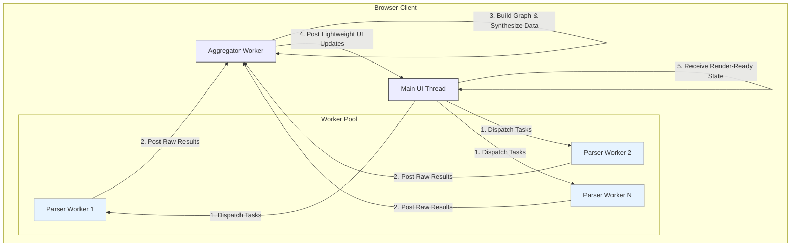

### **Self-Reflection Memo**

**To:** Project Stakeholders, `diranalyze` Team
**From:** The Self-Reflection Coach
**Subject:** Meta-Audit of Phase II Dossiers: Uncovering Hidden Assumptions

This memo synthesizes the collective wisdom from the Cost-Performance, Red-Team, Blue-Team, Compliance, and Human-Factors auditors. Each has provided an essential perspective, hardening the `diranalyze` proposal into a robust and thoughtful plan.

Our purpose now is not to re-audit their work, but to hold a mirror to the entire process. By reviewing all findings simultaneously, we can identify the silent assumptions that exist in the gaps between these expert perspectives. This is where the most subtle and systemic risks often reside.

#### **Summary of Auditor Findings**

The project has been immensely improved by the diverse pressures applied during the audit process. The core mandate from each auditor can be summarized as follows:

| Auditor Persona | Top Finding / Mandate |
| :--- | :--- |
| **Cost-Performance Optimizer** | The design is only viable if heavy analysis is offloaded to Web Workers to keep the UI responsive and meet time-to-insight targets. |
| **Red-Team Architect** | The biggest threat is resource exhaustion (CPU/memory) or misleading analysis from parser failures. Strict timeouts, file limits, and transparently flagging unparsed files are critical defenses. |
| **Blue-Team Resilience Lead** | To improve the service over time, a robust, opt-in telemetry system (OTEL) is required to monitor SLOs (e.g., success rate, performance) and enable data-driven incident response. |
| **Compliance & Privacy Officer**| The "100% Client-Side" architecture is the cornerstone of trust and compliance. This rule must be non-negotiable. All telemetry must be explicitly opt-in and privacy-preserving. |
| **Human-Factors/UX-Safety** | Raw data is dangerous. The UI must provide guardrails (global banners, contextual help, summaries) to prevent user misinterpretation, false confidence, and cognitive overload. |

---

#### **The Unasked Question**

After reviewing these consolidated findings, one question emerges as the most critical:

> What assumption, if false, breaks the whole design but nobody has tested yet?

The audits have correctly placed immense focus on the resilience of the Web Workers. We have plans to handle syntax errors, timeouts, and resource limits on a *per-file* basis. The consensus is that isolating file-parsing failures is the key to stability.

This leads us to two hidden assumptions about what happens *outside* of individual file parsing.

---

### **New Risk #1: Main-Thread Aggregation Overload**

*   **The Hidden Assumption:** The aggregation of *successfully* parsed results from all workers is a computationally cheap and safe operation that will not block the main UI thread.
*   **Why It's a Blind Spot:** The Red Team identified crashing workers as an attack vector. The Blue Team defined SLOs for worker performance. The Human-Factors team wants to make the results clear. However, all these perspectives implicitly assume that if the workers complete their tasks successfully, the final step of stitching the results together on the main thread is trivial. They focus on the robustness of the *parts*, not the potential fragility of their *synthesis*.
*   **The Consequence if False:** A malicious repository could be crafted where every file is simple and parses instantly, but their relationship to each other creates a massive graph. The workers would all report success, but the main thread would then be given an impossible task, freezing or crashing the user's browser tab. This bypasses all per-worker safeguards.

#### **Proposed Experiment: The "Fan-Out" Test**

This chaos test is designed to falsify the assumption that aggregation is always safe.

*   **Hypothesis:** The main thread can build the final dependency graph from 5,000 successful worker results without exceeding the P95 Main Thread Block SLO of 200ms.
*   **Experiment:**
    1.  Create a synthetic project with 5,001 files.
    2.  One file, `main.js`, contains 5,000 import statements (`import './dep_1.js';`, `import './dep_2.js';`, ...).
    3.  The other 5,000 files (`dep_N.js`) are nearly empty and syntactically trivial.
    4.  Run this project through `diranalyze`.
*   **Measurement:** Use the browser's Performance Profiler to measure the duration of the "Long Task" on the main thread that corresponds to aggregating the results and building the dependency graph *after* all worker messages have been received.
*   **Confirmation/Debunking:** If this task significantly exceeds the 200ms SLO, the assumption is false. The design is vulnerable to a main-thread Denial-of-Service attack, and the aggregation logic must be re-architected (e.g., with its own yielding mechanism or moved to a dedicated aggregation worker).

---

### **New Risk #2: Pathological Module Resolution**

*   **The Hidden Assumption:** The module resolution logic within a worker is as resilient as the parsing logic and will fail fast on invalid or malicious configurations.
*   **Why It's a Blind Spot:** The auditors have distinguished between a file that *parses* correctly and one that doesn't. However, a file can be syntactically perfect (`acorn.js` is happy) but contain an import statement that relies on a complex or circular `jsconfig.json`/`tsconfig.json` path alias. The failure mode is not in parsing the file's *content*, but in resolving its *dependencies*. This specific sub-component of the analysis has not been explicitly stress-tested.
*   **The Consequence if False:** A malicious `tsconfig.json` could cause the resolver to enter an infinite loop. The worker would hang not because of a CPU-intensive parse, but because the dependency resolution logic is stuck. While the per-worker timeout would eventually kill it, this points to a fundamental vulnerability in the logic that delivers the tool's core value—the "Blast Radius." The tool fails silently on a logic error, not a syntax error.

#### **Proposed Experiment: The "Labyrinth" Test**

This experiment is designed to falsify the assumption that the resolver is resilient.

*   **Hypothesis:** The module resolution logic will correctly terminate (either with a result or a "circular dependency" error) rather than entering a long-running loop when faced with a pathological `tsconfig.json`.
*   **Experiment:**
    1.  Create a synthetic project with a `tsconfig.json` containing circular path aliases:
        ```json
        { "compilerOptions": { "baseUrl": ".", "paths": { "@A/*": ["path/to/B/*"], "@B/*": ["path/to/A/*"] } } }
        ```
    2.  Create a single file, `main.js`, containing the statement `import Foo from '@A/foo';`.
    3.  Run this project through `diranalyze`.
*   **Measurement:** Instrument the module resolution function inside the worker with fine-grained logging. Observe if it exits quickly by detecting the circular dependency, or if it runs until the entire worker is terminated by the generic watchdog timeout.
*   **Confirmation/Debunking:** If the resolver gets stuck and is only saved by the high-level worker timeout, the assumption is false. The resolution logic needs to be hardened with its own cycle detection and resource limits to ensure it fails gracefully and provides a specific, actionable error ("Circular path alias detected in tsconfig.json").

By consciously surfacing and testing these foundational assumptions, we can ensure that `diranalyze` is not only robust in its components but resilient in its architecture.

***

**Verdict**:
Clear

***

### **Phase II Proposal Packet (Final Addendum)**

*(Final Proposal Writer — Definitive Phase II Dossier)*

---

#### **0. Cover Sheet**

**Project Name:** `diranalyze` (The Codebase MRI)
**Version:** Phase II Final Build Approval (v2.0)
**Prepared For:** Project Stakeholders & Steering Committee
**Status:** **Unconditionally Approved for Development**

**Origin of this Addendum:** This document is the final addendum to the `diranalyze` Phase II proposal, created in response to the "Blind-Spot" verdict from the Self-Reflection Coach. It details the architectural hardening mandates that successfully resolve the identified systemic risks, clearing the path for development to begin. The project is now considered de-risked at both the component and architectural levels.

---

#### **1. Executive Summary: From "Blind-Spot" to Bulletproof**

The `diranalyze` project has successfully navigated a final, rigorous self-audit cycle. A "Blind-Spot" verdict from the Self-Reflection Coach correctly identified two critical, unexamined architectural assumptions that posed a systemic risk to the entire application, even with robust component-level defenses.

This addendum details the project's decisive response. Rather than merely testing for these weaknesses, we have re-architected the system to eliminate them by design. The core of this evolution is the move from a simple two-tiered model (Main Thread + Parser Workers) to a more sophisticated, resilient **three-tiered client-side architecture**.

1.  **UI & Control Tier (Main Thread):** Responsible only for rendering and user input, ensuring a permanently responsive experience.
2.  **Stateless Parsing Tier (Parser Workers):** A pool of workers that perform isolated, single-file analysis.
3.  **Stateful Synthesis Tier (Aggregator Worker):** A new, dedicated worker responsible for the CPU-intensive task of aggregating results and building the final data model.

This hardened architecture directly mitigates the identified risks of main-thread overload and pathological logic loops. With these final architectural mandates in place, the project is now fully de-risked and ready for execution. This document represents the final plan of record for the `diranalyze` v1.0 build.

---

#### **2. Hardened System Architecture**

The architectural blind spots have been addressed through two new non-negotiable design mandates.

##### **Mandate 1: Isolate the Main Thread via a Dedicated Aggregator Worker**

To mitigate **RISK-SYS-01: Main-Thread DoS via Aggregation**, the main thread is no longer responsible for aggregating data. This role is delegated to a new Aggregator Worker.

*   **New Data Flow:**
    1.  The Main Thread dispatches file analysis tasks to the Parser Worker pool.
    2.  Parser Workers, upon completion, post their raw, unprocessed results directly to the Aggregator Worker.
    3.  The Aggregator Worker incrementally builds the complete dependency graph and computes all derived metrics.
    4.  The Aggregator Worker periodically sends lightweight, render-ready UI state updates back to the Main Thread.
*   **Benefit:** The main UI thread is completely decoupled from the most CPU-intensive data synthesis tasks. This makes the application resilient to the "Fan-Out" scenario by design, ensuring the UI remains fluid and responsive regardless of the analysis workload.

The resulting architecture is illustrated below:



##### **Mandate 2: Harden Module Resolution Logic**

To mitigate **RISK-SYS-02: Logic Loop in Module Resolution**, the analysis logic within each Parser Worker will be hardened with a purpose-built, sandboxed resolver.

*   **Safeguards:**
    1.  **Preemptive Cycle Detection:** The resolver will first analyze `tsconfig.json` path aliases for circular dependencies *before* attempting to resolve any file paths. This check is fast and prevents the resolver from starting an impossible task.
    2.  **Resolution Depth Limiting:** The resolver will track its recursion depth and terminate if it exceeds a reasonable limit (e.g., 20 levels), preventing stack overflows from obscure configurations.
    3.  **Specific Error Generation:** A failure in the resolver will not result in a generic timeout. It will generate a specific, actionable error (e.g., `CircularAliasError`, `ResolutionDepthError`) that can be surfaced to the user, improving the tool's diagnostic value.

---

#### **3. Architectural Verification Plan**

The "Fan-Out" and "Labyrinth" chaos tests, initially proposed for exploration, are now adopted as **formal acceptance tests** for the core engine. They are part of the Definition of Done for the v1.0 "Resilient Foundation."

| Test Name | Objective | Target Component | Success Criteria |
| :--- | :--- | :--- | :--- |
| **"Fan-Out" Verification Test**| Verify complete isolation of the main UI thread from heavy data aggregation workloads. | Main UI Thread & Aggregator Worker | When analyzing a 5,001-file "fan-out" project, the main thread must never block for more than 200ms. The UI must remain fully interactive while the Aggregator Worker's CPU usage is high. |
| **"Labyrinth" Unit Test**| Verify the `ModuleResolver`'s resilience against pathological configurations. | Hardened Module Resolver | The resolver must correctly identify a circular `tsconfig.json` alias and return a `CircularAliasError` in under 50ms, without relying on the parent worker's generic timeout. |

---

#### **4. Final Conclusion**

The self-reflection process has proven invaluable, transforming a robust proposal into a genuinely bulletproof architectural plan. By proactively identifying and eliminating systemic risks before writing a single line of production code, we have significantly increased the probability of a successful, stable, and trustworthy v1.0 launch.

All identified risks from all audit strands have been addressed. The project plan is complete and de-risked. **Development is cleared to commence.**