### Proposal Packet
*(Senior Staff PM — Definitive Phase II Dossier)*
---

#### **Consolidated Executive Summary**

**Project Name:** `diranalyze` (The Codebase MRI)
**Version:** Phase II Go/No-Go Decision Dossier v1.1
**Prepared By:** Senior Staff PM (Consolidated View)
**Prepared For:** Project Stakeholders & Steering Committee

This document consolidates findings from the six core Phase II audits for the `diranalyze` project. The consensus is a conditional **"GO"** for Phase II development, contingent on adopting the guardrails outlined herein.

The initial proposal carried significant Human-Factors risk, centered on user misinterpretation leading to negative engineering outcomes. The UX-Safety audit's "Needs-Guardrails" verdict was critical. However, the project team's swift and comprehensive "UX Hardening Plan" directly addressed every raised concern, upgrading the final verdict to "Safe."

This dossier synthesizes the mandates from all audit strands—Cost, Red-Team, Blue-Team, Compliance, UX-Safety, and Self-Reflection—into a single, de-risked Phase II plan. It prioritizes a "Resilient Foundation" (v1.0) focusing on safety, stability, and clarity. We request formal approval to proceed based on this consolidated roadmap.

---
#### **Cost-Performance Strand**
*(Source: Cost-Performance Optimizer Audit)*

#### **1. Key Mandates & Directives**
*   **Action (Engine):** Prototype the core analysis logic in a high-performance language (e.g., Rust via WASM) to benchmark against a pure JS/TS implementation. Performance gains may justify the added complexity.
*   **Action (Caching):** Implement an intelligent file-based caching strategy. Re-process only changed files and their immediate dependents. Provide an explicit "Clear Cache & Re-analyze" option.
*   **Action (UI Thread):** Run all analysis in a worker thread to keep the UI responsive. Implement a multi-stage progress bar for long-running analyses.
*   **Action (Feedback):** For large projects, communicate operational costs (e.g., estimated time). Gracefully report analysis timeouts on a per-file basis.

#### **2. Observability & Incident Response**
*   No strand-specific items. Observability concerns are fully covered by the Blue-Team Resilience Plan (see Appendix D).

#### **3. Reflection & Iteration Hooks**
*   Establish performance benchmarks (e.g., time-to-first-insight for a 1M LOC repository) as a release criterion.

#### **4. Open Questions & Risks**
*   Will the complexity of a bi-lingual (JS + Rust/WASM) codebase offset performance gains for the current team?
*   How will cache invalidation be handled when the analyzer itself is updated? (Requires versioned cache).

---
#### **Red-Team Strand**
*(Source: Red-Team Architect Audit)*

#### **1. Key Mandates & Directives**
*   **Action (Deception):** Implement strict parser timeouts and memory limits. Any file exceeding these must be flagged as "Unable to Analyze Safely." Fuzz the parsing engine with malformed and malicious code.
*   **Action (Obfuscation):** Ensure complexity metrics are multifaceted. Weight Halstead metrics appropriately alongside LOC and Cyclomatic Complexity to better detect obfuscated code.
*   **Action (Reconnaissance):** This is an acceptable, inherent risk for a local-only tool. Any future cloud version will require a new security audit with a focus on strict authorization controls.

#### **2. Observability & Incident Response**
*   No strand-specific items. Observability concerns are fully covered by the Blue-Team Resilience Plan (see Appendix D).

#### **3. Reflection & Iteration Hooks**
*   Conduct periodic "Deception Drills" where one team member attempts to craft a PR that fools `diranalyze`.

#### **4. Open Questions & Risks**
*   Can a malicious `package.json` with crafted dependency declarations cause the resolver to enter an infinite loop?
*   How does the tool handle symbolic links? Could they be used to create recursive analysis paths?

---
#### **Blue-Team Strand**
*(Source: Blue-Team Resilience Lead Audit)*

#### **1. Key Mandates & Directives**
*   **Action (Resilience):** Implement "Graceful Degradation." The tool must not crash on un-parsable files. The UI must always reflect a "Healthy" or "Degraded" analysis state via the global banner mandated by the UX-Safety audit.
*   **Action (Error Reporting):** Implement user-friendly error reporting. Provide a unique error ID and a one-click "Copy Debug Info" button that packages non-sensitive diagnostic data for bug reports.
*   **Action (Telemetry):** Implement opt-in, privacy-preserving telemetry to understand usage patterns and failure rates. The tool must be fully functional if the user opts out.

#### **2. Observability & Incident Response**
*   Detailed plans for logging, monitoring, and incident response are consolidated in Appendix D.

#### **3. Reflection & Iteration Hooks**
*   Use telemetry data to build a "Top 10 Failures" dashboard to prioritize bug fixes.

#### **4. Open Questions & Risks**
*   What is the threshold for a "Degraded" analysis status? (e.g., 1 file vs 5% of files). This may need to be user-configurable.

---
#### **Compliance & Privacy Strand**
*(Source: Compliance & Privacy Officer Audit)*

#### **1. Key Mandates & Directives**
*   **Action (Local-First):** Maintain the local-only analysis model as a core privacy principle. All UI and documentation must clearly state: "Your code is analyzed locally and is never uploaded."
*   **Action (Consent):** Telemetry collection requires explicit, informed, opt-in consent during onboarding, explaining what is collected and why.
*   **Action (PII):** Ensure cached data is stored securely. Warn users not to paste debug information (which may contain code) into public forums.
*   **Action (Future):** Any future cloud-connected version will trigger a new, mandatory Compliance & Privacy audit.

#### **2. Reflection & Iteration Hooks**
*   Periodically review all telemetry data points to ensure no PII is being inadvertently collected.
*   Maintain a public "Privacy & Data Handling" document.

#### **3. Open Questions & Risks**
*   Is the warning about pasting debug info prominent enough to prevent accidental disclosure of private code?

---
#### **Human-Factors & UX-Safety Strand**
*(Source: Human-Factors & UX-Safety Reviewer)*

#### **1. Initial Findings Summary**
*   The initial UX proposal was a strong start but carried a **High** risk of user misinterpretation, information overload, and false confidence from incomplete data.
*   Key failure modes identified included users misinterpreting "red" as "bad code," becoming paralyzed by long lists of dependencies, and making decisions based on incomplete analysis they believed to be complete. A "Needs-Guardrails" verdict was issued.

#### **2. Project Response & Hardening Plan**
*   The project lead's formal response and "UX Hardening Plan" was exemplary, accepting all findings and integrating safeguards into the core development roadmap.
*   The plan commits fully to the **Clarity, Context, and Candor** pillars, transforming the identified risks into core feature requirements.

#### **3. Consolidated Guard-rail Mandates**
*   **Candor (Unimpeachable Honesty):** A global, non-dismissible "Analysis Health Banner" will be implemented, making incomplete analysis impossible to ignore.
*   **Context (Data with Explanation):** All key metrics will feature on-demand `(ℹ️)` icons linking to in-app explanations, eliminating ambiguity.
*   **Clarity (Reduced Cognitive Load):** "Blast Radius" lists will be summarized by default, with powerful filtering and pagination to make them manageable.
*   **Accessibility (Universal Access):** WCAG 2.2 AA compliance is adopted as a "Definition of Done" for all UI components.
*   See **Appendix A** for the full Usability-Caused Failure Modes & Misuse Matrix.
*   See **Appendix B** for the hardened User-Flow & Risk Map.
*   See **Appendix C** for the detailed Accessibility (WCAG 2.2 AA) Checklist.

**Verdict: Safe**

---
#### **Self-Reflection Strand**
*(Source: Self-Reflection Facilitator Audit)*

#### **1. Key Mandates & Directives**
*   **Action (Process):** Formalize the "Six-Strand Audit" process for all new major projects, as it successfully identified a critical, non-obvious project risk.
*   **Action (Perspective):** Mandate that usability testing includes personas like a "competent junior" or a developer from an adjacent team to combat "The Expert's Curse" and surface confusion points early.
*   **Action (Artifacts):** Adopt the "Failure Mode Matrix" and "Consolidated Guard-rail Checklist" as standard artifacts for future design reviews.

#### **2. Observability & Incident Response**
*   No strand-specific items. Process observability will be handled through project retrospectives.

#### **3. Reflection & Iteration Hooks**
*   Conduct a project pre-mortem before each major release to anticipate failures.

#### **4. Open Questions & Risks**
*   Does the team have a psychologically safe environment to raise "this is confusing" concerns outside of a formal audit?

---
### **Appendices**
---

#### **Appendix A: Usability-Caused Failure Modes & Misuse Matrix**

| Failure Mode Category        | Scenario                                                                                                                               | Potential Harm                                                                                               | Recommended Guardrail                                                                                                                                                                                                                                                                                                 | Severity |
| :--------------------------- | :------------------------------------------------------------------------------------------------------------------------------------- | :----------------------------------------------------------------------------------------------------------- | :-------------------------------------------------------------------------------------------------------------------------------------------------------------------------------------------------------------------------------------------------------------------------------------------------------------------- | :------- |
| **Data Incompleteness Risk** | User misses or misunderstands "Warning: Analysis is incomplete. 1 file could not be parsed."                                         | User makes decisions based on an incomplete, potentially misleading understanding of the codebase.           | **Global Banner:** Highly visible, fixed banner stating "Analysis incomplete: X files unparsed. Click for details." Clicking it highlights the relevant files. Global "Analysis Health: DEGRADED" status. User-friendly parser errors. | Critical |
| **Misinterpretation (Data)** | User sees "RED" on heatmap, assumes "bad code," and refactors without understanding *why* it's red.                                  | Wasted engineering effort, introduction of new bugs, demoralization.                                         | **Color + Icon + Context:** Ensure color is not the *sole* indicator (use icons). Provide an accessible legend. Tooltips must show raw metrics *and* the thresholds used (e.g., "High > 15 CC").                                         | High     |
| **Misinterpretation (Impact)** | User misunderstands "Blast Radius: 18 Dependents" if many are minor test files or if "Top 5" hides a critical one.                 | Over/underestimation of change risk, leading to unnecessary caution or missed critical impacts.              | **Filtering & Grouping:** Allow filtering/grouping of dependents by type (source, test, docs), directory, or custom tags. Offer compact visualization of dependency graph. Clearly label sorting criteria.                                    | High     |
| **Information Overload**     | "Blast Radius" list of 50+ dependents overwhelms user, even if sorted and partially collapsed.                                      | Analysis paralysis, user ignores the data, feeling of being overwhelmed.                                     | **Progressive Disclosure & Interaction:** Implement faceted filtering (path, type), search within dependents, and pagination/virtual scrolling for very long lists. Default to a "Top 5/10" summary view.                               | Med      |
| **Accessibility Barrier**    | User with color vision deficiency cannot distinguish heatmap states. User relying on keyboard cannot navigate interactive elements.  | Exclusion of users, frustration, inability to use the tool effectively or at all.                              | **WCAG 2.2 AA Compliance:** Adhere to the full standard. Text/icon alternatives for color, full keyboard navigation, ARIA for screen readers, high contrast themes, and visible focus states are mandatory.                             | High     |
| **Cognitive Friction**       | New user struggles to understand metrics like "Cyclomatic Score" or "Symbol Centrality" despite tooltips.                            | Frustration, abandonment of tool, superficial use, misapplication of metrics.                                  | **In-App Glossary:** Link tooltips to an in-app "Glossary" / "Learn More" panel. Use progressive disclosure in tooltips (brief explanation, then option to expand).                                                               | Med      |

---
#### **Appendix B: Hardened User-Flow & Risk Map**

```mermaid
graph TD
    A[User Initiates Analysis] --> B{Analysis in Progress...};
    B -- "Cancellable w/ Multi-Stage Progress Bar" --> B;
    B -- Analysis Complete --> C[UI Renders];

    subgraph C [Main UI - Global Safeguards]
        C0["Global Banner: 'Analysis Incomplete: 2 files failed'. Click to see." - VISIBLE IF DEGRADED]
        C1[File Tree & Heatmap w/ Color + Icons] -->|"User Clicks 'api.js' (🔴 High)"| D[Details Panel];
    end

    subgraph D [Details Panel for 'api.js']
        D1("<strong>Blast Radius: 18 Dependents</strong>") --> D2["[Filter: Hide Tests] Top 5 shown (Show All)"];
        D3("<strong>Complexity: High</strong> (Score: 78/100) (ℹ️)") --> D4["Tooltip on ℹ️: Explains metric, thresholds, & score components."];
    end
```

**Description:** This flow manages cognitive load and builds trust. Analysis failures are flagged globally before any data is consumed. The main UI uses redundant encoding (color + icon) for accessibility. The details panel defaults to a summary and provides on-demand context for all metrics, preventing overload while ensuring clarity.

---
#### **Appendix C: Accessibility Checklist (WCAG 2.2 AA) - High-Level**

*   **[ ] 1. Perceivable:**
    *   **1.1 Text Alternatives:** All non-text content (icons, charts) has text alternatives.
    *   **1.4.1 Use of Color:** Color is not the sole means of conveying information (e.g., heatmap needs icons/patterns).
    *   **1.4.3 Contrast (Minimum):** Text and UI elements meet AA contrast ratios.
*   **[ ] 2. Operable:**
    *   **2.1 Keyboard Accessible:** All functionality is available and operable via keyboard.
    *   **2.4.7 Focus Visible:** A clear, visible focus indicator is always present for keyboard users.
    *   **2.5.5 Target Size:** Touch/mouse targets are adequately sized.
*   **[ ] 3. Understandable:**
    *   **3.3.2 Labels or Instructions:** Labels and instructions are provided for all interactive elements.
    *   **3.2.2 On Input:** Changing a setting does not cause a change of context unless the user is advised.
*   **[ ] 4. Robust:**
    *   **4.1.2 Name, Role, Value:** Custom controls use ARIA to report their state to assistive technologies.

---
#### **Appendix D: Blue-Team Observability & Incident Response Plan**

*   **(TODO) 1. Logging Standard:** Define structured log formats (JSON) for different event types (e.g., analysis_started, file_parsed, parse_failed, internal_error).
*   **(TODO) 2. Telemetry Dashboard Mockup:** Design the internal dashboard for visualizing key health metrics (e.g., avg. analysis time, % of sessions with parse errors, feature adoption rate).
*   **(TODO) 3. Incident Response Protocol (Cloud Version):** Define roles, communication channels, and resolution steps for P1/P2 incidents for any future cloud service. For the local tool, this primarily involves a clear bug reporting and triage process.