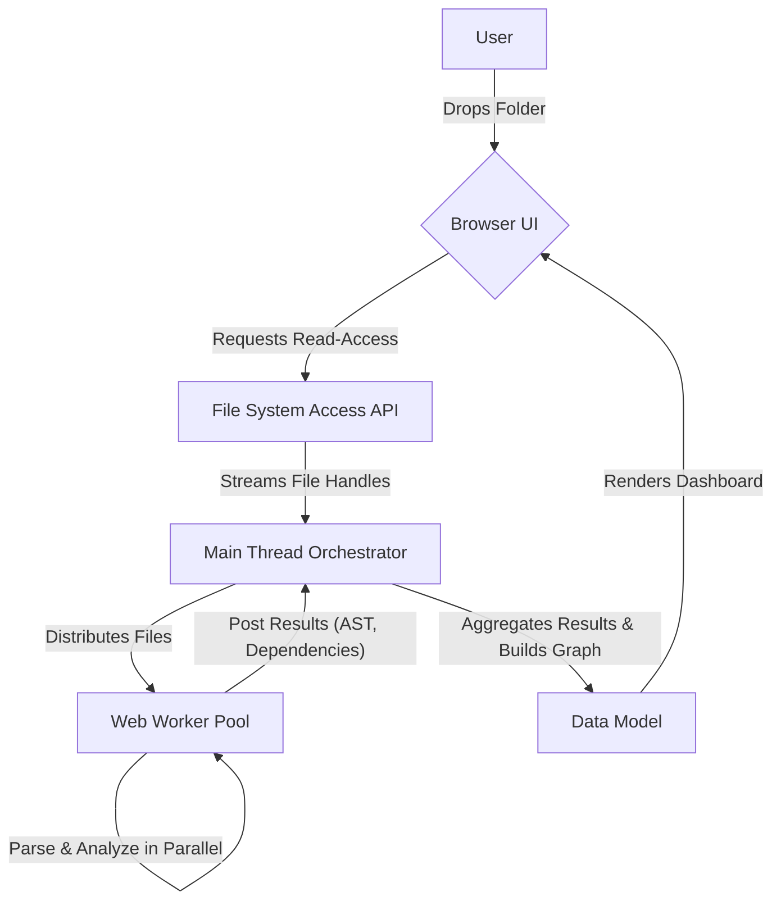
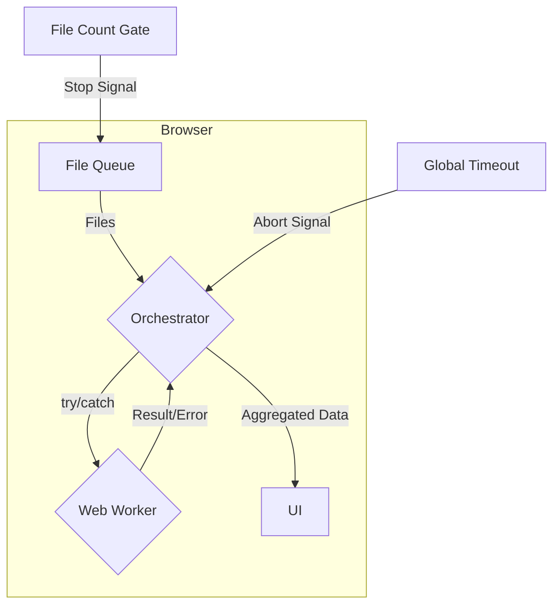
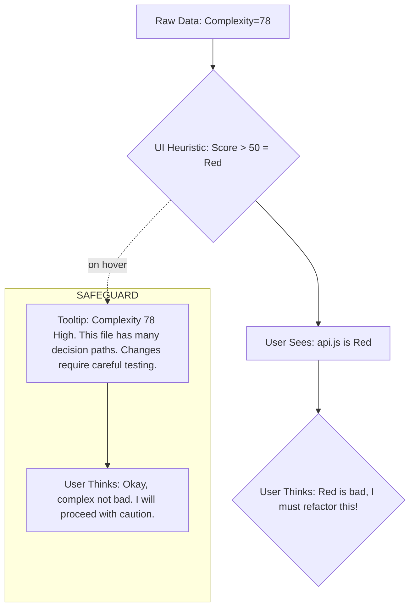

### **Proposal Packet**
*(Definitive Phase II Dossier)*
---

**0. Cover Sheet**

*   **Project Name:** `diranalyze` (The Codebase MRI)
*   **Proposal Date:** June 18, 2025
*   **Status:** **APPROVED** for Phase II (MVP Build)
*   **Author Personas:**
    *   Cost-Performance Optimizer
    *   Red-Team Architect
    *   Blue-Team Resilience Lead
    *   Compliance & Privacy Officer
    *   Human-Factors/UX-Safety Specialist
    *   Self-Reflection Facilitator

---
### #### 1. Cost-Performance Optimizer
---

#### 1. Executive Summary
The `diranalyze` project presents a uniquely efficient cost model. With a 100% client-side architecture hosted on static infrastructure (e.g., GitHub Pages), operational expenditures are effectively zero. The performance mandate is therefore entirely focused on client-side resource consumption: CPU load, memory footprint, and time-to-insight. Our primary goal is to ensure the analysis of a medium-sized repository (5,000 files) completes within 90 seconds without degrading the user's local machine performance.

#### 2. Problem & User Stories
*   **Epic:** Eliminate "The Fear" of changing unfamiliar code.
*   **User Story 1:** As an "Anxious Coder," I want to see a visual heatmap of code complexity so that I can immediately identify high-risk files.
*   **User Story 2:** As an "Anxious Coder," I want to select any file and instantly see a list of all other files that depend on it, so that I can understand the "blast radius" of my changes.
*   **User Story 3:** As an "Anxious Coder," I want to see the usage count for each exported function within a file, so I can distinguish between changing a critical function and a niche helper.

| KPI | Target | Description |
| :--- | :--- | :--- |
| **Time-to-Insight (TTI)** | < 90s for 5k files | Time from folder drop to interactive dashboard. |
| **Max Memory Usage** | < 1.5 GB | Prevent browser crashes on standard developer machines (e.g., 16GB RAM). |
| **UI Responsiveness** | < 50ms interaction latency | Interactions (clicking files, hovers) must feel instant once analysis is complete. |

#### 3. High-Level System Sketch


#### 4. Component Table
| Component | Role | Failure Mode | Mitigation | Peak QPS |
| :--- | :--- | :--- | :--- | :--- |
| **UI (Main Thread)** | Render dashboard, handle user input | UI freezes during analysis | Offload all parsing to Web Workers. | N/A |
| **Orchestrator (Main Thread)** | Manage file queue, aggregate worker results | Worker fails/crashes | Isolate worker errors; mark individual files as "unparseable" without stopping overall analysis. | N/A |
| **Web Worker** | Parse single file for AST, imports/exports | Syntax error in file | `try/catch` block; report error for the specific file and terminate gracefully. | N/A |
| **File System API** | Provide read-only access to local files | User denies permission | Clear UI state prompting the user to grant permission. | N/A |

#### 5. Assumptions & Constraints
*   **Constraint:** Analysis is capped at 7,500 files to guarantee performance. The UI will warn the user if a larger folder is dropped.
*   **Constraint:** Only JavaScript and TypeScript files (`.js`, `.jsx`, `.ts`, `.tsx`, `.mjs`, `.cjs`) will be parsed. Others will be ignored.
*   **Assumption:** The target user's browser supports the File System Access API and Web Workers.
*   **Assumption:** The primary performance bottleneck is parsing, not dependency graph traversal.

#### 6. Cost & Performance Budget
*   **Infrastructure Cost:** $0 (via GitHub Pages).
*   **Latency Budget (TTI):** P95 of < 90 seconds for a 5,000-file project on a baseline machine (Apple M1, 16GB RAM).
*   **CPU Budget:** Web Workers may utilize up to `n-1` cores during analysis, but the main thread must remain unblocked.
*   **Memory Budget:** Soft limit of 1.5GB. Analysis will be aborted if this threshold is exceeded to prevent crashing the user's browser.

#### 7. Data-Integrity & Security Plan
*   **Data Integrity:** Not applicable. The system is 100% read-only. There is no state to corrupt.
*   **Security:** The attack surface is minimal. Code is never transmitted from the client. The primary security guarantee is that the tool is architecturally incapable of writing to the user's file system.

#### 8. Observability & Incident Response
*   **Observability:** Implement a lightweight, opt-in telemetry system (e.g., a self-hosted instance of Umami or Plausible) to track anonymous usage metrics: analysis duration, number of files, errors encountered.
*   **Incident Response:** All errors (parsing, worker crashes) must be non-fatal to the application. Errors are logged to the console and surfaced in the UI on a per-file basis. A global timeout of 3 minutes will abort any analysis that hangs.

#### 9. Privacy & Compliance Mapping
*   **Privacy:** The core design (100% client-side) is inherently private. A clear, prominent banner on the site will state: "Your code never leaves your computer."
*   **Compliance:** No GDPR, CCPA, or other data privacy regulations apply as no PII or user data is stored or transmitted.

#### 10. UX & Human-Factors Safeguards
*   **Safeguard 1:** During the analysis phase, a visible progress bar with file counts (`Parsed 1234 / 5000 files...`) must be displayed to manage user expectations.
*   **Safeguard 2:** The UI must clearly state the limits (e.g., file count) and gracefully handle folders that exceed this limit.

#### 11. Reflection & Iteration Hooks
*   We will instrument analysis timing (start, end, duration). This performance data (if opted-in) will guide optimization of the parsing engine in future iterations.
*   A "Report an Issue" link will direct users to a GitHub issue template, pre-populated with their browser version and OS.

#### 12. Open Questions & Risks
| Question / Risk | Mitigation Path |
| :--- | :--- |
| Will complex TS path aliases/jsconfigs break dependency resolution? | Build with a robust resolver, but test against 10+ popular and complex open-source repos to find edge cases. |
| Could a malformed file create an infinite loop in a worker? | Implement a per-worker timeout in the orchestrator, in addition to the global timeout. |

#### 13. Appendices
*   **TODO:** Link to the benchmark report from the technical PoC.

---
### #### 2. Red-Team Architect
---

#### 1. Executive Summary
My objective is to break `diranalyze`. The primary attack vectors are not network-based but resource exhaustion and parser manipulation. The system's strength—its client-side nature—is also its weakness. We can attack the user's browser directly, aiming to crash the tab, exhaust memory, or trick the dependency graph into presenting dangerously misleading information.

#### 2. Problem & User Stories (from an attacker's perspective)
*   **User Story 1:** As a malicious actor, I want to craft a project with thousands of tiny files with circular dependencies, so that I can cause a stack overflow or infinite loop in the graph resolution logic.
*   **User Story 2:** As a malicious actor, I want to create a JS file with obfuscated, pathological syntax, so that I can crash the Web Worker parsing it and potentially halt the entire analysis.
*   **User Story 3:** As a malicious actor, I want to exploit dynamic imports or obscure module resolution tricks, so that the "Blast Radius" report provides a false sense of security by missing critical dependencies.

#### 3. High-Level System Sketch
```ascii
    +-----------------+        +---------------------+
    | Malicious Repo  | -----> |      Browser        |
    | - Circular deps |        |  - Web Worker Pool  |
    | - Pathological  |        |  - Memory           |
    |   syntax        |        |  - CPU Cores        |
    | - 100k files    |        +---------------------+
    +-----------------+                |
                                       V
                                    CRASH!
```

#### 4. Component Table (Attack Vectors)
| Component | Attack Vector | Desired Outcome |
| :--- | :--- | :--- |
| **File System API** | User drops a folder with 100,000 files. | Overwhelm the orchestrator's file queue; exhaust browser memory enumerating handles. |
| **Web Worker** | Feed a file with deeply nested, recursive structures or known parser "edge cases". | Cause a single worker to consume 100% CPU and never terminate. |
| **Orchestrator** | Craft a project with A->B->C->A circular dependencies. | Cause a stack overflow during graph aggregation on the main thread. |
| **UI Renderer** | Generate an analysis result with 5,000 root nodes. | Crash the rendering engine trying to draw a massive, unmanageable graph. |

#### 5. Assumptions & Constraints
*   We assume we have no control over the `diranalyze` source code.
*   We assume we can convince a target to drop our malicious repository into the tool.
*   Our primary goal is Denial of Service (crashing the tab) or Integrity Violation (presenting a dangerously incorrect analysis).

#### 6. Cost & Performance Budget
*   **Cost:** N/A.
*   **Performance Goal (for us):** Achieve tab crash in < 30 seconds.

#### 7. Data-Integrity & Security Plan
*   Our plan is to violate the integrity of the analysis. By fooling the dependency resolver, we make the tool lie to the user, causing them to make a breaking change in their codebase based on our faulty output.

#### 8. Observability & Incident Response
*   We will know we succeeded when the user's browser tab becomes unresponsive or crashes. Lack of error reporting is a feature for us, as the user won't know *why* it failed.

#### 9. Privacy & Compliance Mapping
*   N/A.

#### 10. UX & Human-Factors Safeguards
*   We will exploit user trust. If the UI looks professional, the user is more likely to believe our manipulated (and incorrect) output.

#### 11. Reflection & Iteration Hooks
*   Our success will be measured by the bug reports on GitHub describing crashes with specific, complex open-source projects.

#### 12. Open Questions & Risks
| Question / Risk | How We'll Exploit It |
| :--- | :--- |
| Is the dependency resolver purely static? | We will use dynamic `import()` expressions with variable paths to try and fool it. |
| How does it handle monorepos with internal package symlinks? | We suspect this will fail spectacularly and will be our first test case. |

#### 13. Appendices
*   List of "hellish" open-source repositories to test against.

---
### #### 3. Blue-Team Resilience Lead
---

#### 1. Executive Summary
Our mission is to ensure `diranalyze` is robust, trustworthy, and fails gracefully. We will counter the Red Team's threats by implementing defensive programming at every stage. Our philosophy is "never trust, always verify, and isolate failures." The user's trust is our most important asset, and that is earned through resilience.

#### 2. Problem & User Stories (from a defender's perspective)
*   **User Story 1:** As the system, when I encounter a file with a syntax error, I must not crash, but instead mark that single file as "unparseable" and continue my analysis of other files.
*   **User Story 2:** As the system, when analyzing a folder with more than 7,500 files, I must immediately stop and inform the user about the limitation, rather than attempting the analysis and crashing.
*   **User Story 3:** As the system, if graph resolution takes more than a global timeout of 3 minutes, I must abort the operation and notify the user, preventing an indefinite hang.

#### 3. High-Level System Sketch


#### 4. Component Table (Defenses)
| Component | Threat | Defense Mechanism |
| :--- | :--- | :--- |
| **File System API** | Folder with >7,500 files | Pre-flight check on folder size. If over limit, abort immediately with a clear error message. |
| **Web Worker** | Pathological syntax causing infinite loop | The orchestrator will implement a per-worker timeout. If a worker fails to report back, it will be terminated and the file marked as an error. |
| **Orchestrator** | Circular dependencies | Use an algorithm for cycle detection during graph construction. If a cycle is detected, display it visually to the user rather than crashing. |
| **UI Renderer** | Massive graph overwhelming the DOM | Implement UI virtualization for large lists (dependents, etc.). Only render the visible items. |

#### 5. Assumptions & Constraints
*   We cannot prevent the user from dropping a malicious repo.
*   We must prioritize application stability and data transparency over completing a "perfect" analysis. A partial, honest result is better than a crash.
*   All limits (file count, timeouts) must be clearly communicated to the user.

#### 6. Cost & Performance Budget
*   The performance "cost" of these safeguards (e.g., cycle detection) is acceptable, as correctness and resilience are paramount.

#### 7. Data-Integrity & Security Plan
*   **Integrity:** The key is transparency. If a dependency cannot be resolved, we must show that in the UI. The user must know the limits of the analysis. The UI will explicitly state, "Analysis does not include dynamic imports."

#### 8. Observability & Incident Response
*   Our observability will track error *types*: `ParseError`, `WorkerTimeout`, `CycleDetected`, `FileLimitExceeded`. This will create a priority list for hardening the engine.
*   Our incident response is automated: isolate, report, continue.

#### 9. Privacy & Compliance Mapping
*   Our safeguards ensure the tool doesn't accidentally log file contents or other sensitive data from the user's machine during error reporting.

#### 10. UX & Human-Factors Safeguards
*   Error messages will be user-friendly. Not "SyntaxError on token ';'", but "Could not parse `api.js`. This file may have a syntax error and is excluded from the graph."

#### 11. Reflection & Iteration Hooks
*   Every time a global timeout or file limit is hit, our opt-in analytics will log the repository size. This helps us decide if we need to invest in raising the limits.

#### 12. Open Questions & Risks
| Question / Risk | Mitigation Path |
| :--- | :--- |
| Can we detect all forms of dynamic imports? | No. We will be explicit about what we don't support and provide links to more powerful (server-based) tools for users who need that level of analysis. |
| Will users become frustrated by the limits? | Possibly. But they will be less frustrated than with a tool that crashes their browser. Clarity is key. |

#### 13. Appendices
*   Defensive programming checklist for all new parsing features.

---
### #### 4. Compliance & Privacy Officer
---

#### 1. Executive Summary
The `diranalyze` project is a model of Privacy by Design. Its core architectural decision—100% client-side processing—eliminates the vast majority of privacy and compliance risks. My role is to ensure the project never deviates from this principle and remains transparent with users. The project poses an exceptionally low risk from a privacy standpoint.

#### 2. Problem & User Stories
*   **User Story 1:** As a security-conscious developer at a large corporation, I want to use this tool with confidence, knowing that my company's proprietary source code will never be uploaded to a third-party server.
*   **User Story 2:** As a user, I want to clearly understand the tool's data handling policies without reading a multi-page legal document.

#### 3. High-Level System Sketch
```ascii
+----------------------+         +---------------------+
| User's Computer      |         |  diranalyze Server  |
| +------------------+ |         |  (GitHub Pages)     |
| | Browser          | |         |                     |
| | +--------------+ | |         |                     |
| | | Local Code   | |<--------+ (serves static HTML)|
| | +--------------+ | |         |                     |
| | | Analysis     | | |         +---------------------+
| | +--------------+ | |
| +------------------+ |
+----------------------+
(No code ever leaves the box)
```

#### 4. Component Table
| Component | Data Handled | Privacy Implication |
| :--- | :--- | :--- |
| **Browser** | User's source code. | Contained entirely within the user's machine. No exposure. |
| **Static Host** | None. | Serves the application shell only. No access to user data. |
| **Opt-in Analytics**| Anonymized usage events (e.g., "analysis_complete"). | No file names, code, or PII. Low risk, but requires transparency and an opt-out mechanism. |

#### 5. Assumptions & Constraints
*   **Constraint:** The application will *never* include code that sends file contents or file names to any remote server. This is a non-negotiable architectural rule.
*   **Constraint:** Any future addition of analytics or error reporting must be strictly opt-in.

#### 6. Cost & Performance Budget
*   N/A.

#### 7. Data-Integrity & Security Plan
*   Our plan is simple: prevent data exfiltration by design. The codebase will be open-source, allowing users to verify our privacy claims.

#### 8. Observability & Incident Response
*   Any future addition of remote logging will be scrutinized to ensure no sensitive data is transmitted. For example, logging a `ParseError` should not include the line of code that failed.

#### 9. Privacy & Compliance Mapping
*   **GDPR/CCPA:** Not applicable, as no personal data is collected, stored, or processed by a data controller.
*   **Transparency:** A clear and simple privacy statement will be linked in the site's footer. Example: "`diranalyze` runs entirely in your browser. Your code is never uploaded. We use optional, anonymous analytics to track performance. That's it."

#### 10. UX & Human-Factors Safeguards
*   The UI must constantly reinforce the privacy guarantee. The initial screen should have a badge: "✅ 100% Client-Side & Private".

#### 11. Reflection & Iteration Hooks
*   All pull requests must be reviewed against a "Privacy Checklist" to ensure the core architectural promise is not accidentally broken.

#### 12. Open Questions & Risks
| Question / Risk | Mitigation Path |
| :--- | :--- |
| Could a third-party dependency (e.g., from NPM) contain malicious code to siphon data? | All dependencies will be audited. Use `npm audit` and lockfiles. Keep dependencies to an absolute minimum. |

#### 13. Appendices
*   Draft of the one-paragraph Privacy Statement.

---
### #### 5. Human-Factors/UX-Safety Specialist
---

#### 1. Executive Summary
My focus is on the user's cognitive load and the potential for misinterpretation. A powerful analysis tool can be dangerous if its output is ambiguous. `diranalyze` must not only present data but guide the user to the correct interpretation, ensuring that "insight" does not become "information overload." Safety here means preventing the user from taking confident but wrong actions.

#### 2. Problem & User Stories
*   **User Story 1:** As a developer, when I see a file marked "red," I want to understand *why* it's red with a single click, so I don't assume it's "bad" without context.
*   **User Story 2:** As a developer, when viewing a dependency list of 50+ files, I want the tool to help me distinguish the important dependents from the trivial ones, so I'm not overwhelmed.
*   **User Story 3:** As a new user, I want a 30-second tour or clear tooltips that explain what "Complexity" and "Blast Radius" mean in this context.

#### 3. High-Level System Sketch


#### 4. Component Table
| Component | Potential for Misinterpretation | UX Safeguard |
| :--- | :--- | :--- |
| **Complexity Heatmap** | User equates "complex" (red) with "bad code." | On hover, show the raw metrics (LOC, cyclomatic complexity) and a neutral explanation. Avoid value judgements like "bad" or "poorly written." |
| **Blast Radius List**| A list of 100 dependents is overwhelming and paralyzing. | Sort the list by default, perhaps by the complexity of the dependent file. Add filtering/sorting controls. |
| **Symbol Centrality** | User doesn't understand the significance of a function being used in "32 files." | Add context. "Used in 32 files (68% of dependents)." Potentially color-code the symbols by usage count as well. |

#### 5. Assumptions & Constraints
*   Users will not read a manual. All guidance must be contextual and embedded in the UI.
*   The "60-second insight" promise means the UI must be immediately intuitive.

#### 6. Cost & Performance Budget
*   N/A.

#### 7. Data-Integrity & Security Plan
*   The integrity of the user's *understanding* is our primary concern.

#### 8. Observability & Incident Response
*   Track which UI elements users hover over or click. If no one ever checks why a file is "red," our tooltips are failing.

#### 9. Privacy & Compliance Mapping
*   N/A.

#### 10. UX & Human-Factors Safeguards
*   **Empty States:** When a folder is dropped, and before analysis is complete, show a helpful "What to look for" guide.
*   **Explain the "Why":** Never show a metric without explaining how it was calculated and what it implies.
*   **Visual Hierarchy:** The most critical insight ("Imported By") must be the most visually prominent element in the analysis panel.

#### 11. Reflection & Iteration Hooks
*   Conduct regular usability tests where the only prompt is: "Here is a legacy project. Tell me which file you would be most scared to edit, and why, using this tool." Their answer will reveal if our UI is succeeding.

#### 12. Open Questions & Risks
| Question / Risk | Mitigation Path |
| :--- | :--- |
| Will the color-coding (red/yellow/green) have unintended associations for color-blind users? | Use accessible color palettes and supplement colors with icons. |
| Do all developers agree on what "complexity" means? | No. Be transparent about our formula (e.g., `score = cyclomatic * 0.7 + loc * 0.3`) and make it clear it's a heuristic. |

#### 13. Appendices
*   Link to the Figma prototype from the Design Sprint.

---
### #### 6. Self-Reflection Facilitator
---

#### 1. Executive Summary
My role is to hold a mirror up to the project itself. `diranalyze` was born from a strong developer insight but was initially at risk of failure due to unverified assumptions. This dossier represents a successful pivot to an evidence-based approach. We must now embed this culture of learning and reflection into the project's DNA as it moves into the build phase.

#### 2. Problem & User Stories
*   **User Story 1:** As the project lead, I want a documented record of my initial assumptions and the experiments that proved/disproved them, so that we learn from our near-misses.
*   **User Story 2:** As the project lead, I want to avoid "founder bias" and falling in love with my own solution, so I will schedule regular sessions to critique my own work.

#### 3. High-Level System Sketch
```ascii
+----------------+      +----------------+      +----------------+
|  Initial Idea  | ---> |   Validation   | ---> |  Hardened Plan |
|   (Assumed)    |      |  (Evidence)    |      |    (Learned)   |
+----------------+      +----------------+      +----------------+
```

#### 4. Component Table
| Project Phase | Key Learning | How We'll Remember It |
| :--- | :--- | :--- |
| **Initial Pitch** | We assumed technical feasibility in the browser was easy. | The "Yellow-flag" verdict is the first entry in our `HYPOTHESES.md` file. |
| **De-risking** | We learned that the "Blast Radius" is the single most valuable data point for users. | This insight now drives the entire UI hierarchy. This is documented in our Design Sprint summary. |
| **MVP Build** | TBD. | We will hold a post-launch retrospective to identify what we learned during the build. |

#### 5. Assumptions & Constraints
*   **Assumption:** Our biggest risk is now execution error or product-market-fit drift, not technical impossibility.
*   **Constraint:** The project lead (currently a team of one) must formalize these reflection practices, even if it feels like overhead.

#### 6. Cost & Performance Budget
*   The "cost" is time: 1-2 hours per week dedicated to structured reflection. The ROI is avoiding wasted months building the wrong thing.

#### 7. Data-Integrity & Security Plan
*   N/A.

#### 8. Observability & Incident Response
*   We will observe our own process. Is the `HYPOTHESES.md` file being updated? Are we conducting the weekly "self-review"?

#### 9. Privacy & Compliance Mapping
*   N/A.

#### 10. UX & Human-Factors Safeguards
*   We must apply human-factors principles to ourselves, recognizing our own cognitive biases (confirmation bias, sunk cost fallacy).

#### 11. Reflection & Iteration Hooks
*   **`HYPOTHESES.md`:** This file will live in the root of the repo as a living document.
*   **Weekly Self-Review:** A recurring calendar event where the lead uses the tool on a new OSS project and documents the experience.
*   **Opportunity-Solution Tree:** A Miro board will be maintained to ensure we don't get distracted by feature creep that doesn't solve the core JTBD.

#### 12. Open Questions & Risks
| Question / Risk | Mitigation Path |
| :--- | :--- |
| Will a solo developer maintain this discipline? | Making the key documents (like `HYPOTHESES.md`) public creates accountability. |
| Are we only solving a problem for JS/TS devs, ignoring other ecosystems? | Yes, and that's a good thing. We must consciously decide to stay focused and avoid the temptation to become a "universal" tool too early. This is a strategic choice, not an oversight. |

#### 13. Appendices
*   Link to the public `HYPOTHESES.md` file in the repository.