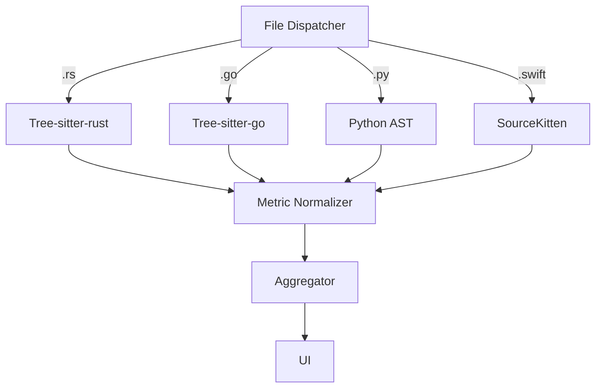

### diranalyze — Phase II‑A Addendum

## *(Multi‑Language Expansion “Rust | Go | Python | Swift”)*

#### 0 · Purpose

Document the scope, risk deltas, and audit actions required to extend **diranalyze** from a JS/TS‑only analyzer to a **polyglot** scanner supporting Rust, Go, Python, and Swift.

---

#### 1 · Executive Delta Summary

| Strand               | What Stays Valid                 | What Must Change               | Owner        | Due     |
| -------------------- | -------------------------------- | ------------------------------ | ------------ | ------- |
| **Cost‑Performance** | Caching, worker‑pool, UI budgets | New KPI table per language     | Perf Eng     | v1.1    |
| **Red Team**         | Fuzz methodology                 | Fuzz each new parser           | Sec Eng      | v1.1    |
| **Blue Team**        | Degrade‑gracefully banner        | Expand mixed‑repo corpus       | SRE          | v1.1    |
| **Compliance**       | Local‑only processing            | Update docs list               | Legal        | v1.0    |
| **UX‑Safety**        | Global banner, tool‑tips         | Per‑language legends & filters | UX Lead      | v1.2    |
| **Self‑Reflection**  | Audit cadence                    | Add language‑onboarding retro  | Scrum Master | ongoing |

---

#### 2 · Architecture Delta

---

#### 3 · Updated Cross‑Language KPIs

| KPI                      | Mixed‑Repo Target (10 k files, 3 langs) | Test Method      |
| ------------------------ | --------------------------------------- | ---------------- |
| **Initial analysis p95** | ≤ 120 s                                 | Benchmark corpus |
| **Peak RAM**             | ≤ 1.2 GB                                | Profiler         |
| **Parser timeout/file**  | 5 s                                     | Chaos‑test suite |
| **Crash‑free sessions**  | ≥ 99.9 %                                | Opt‑in telemetry |

---

#### 4 · Risk Addendum

1. **Parser supply‑chain CVEs** – pin SHA‑256, nightly scan.
2. **Metric apples↔oranges** – z‑score normalisation per language.
3. **Cache bloat** – shard cache by language, raise FD limits.

---

#### 5 · Audit Actions Checklist

| Action                        | Strand     | Sprint  |
| ----------------------------- | ---------- | ------- |
| Integrate dispatcher skeleton | Core       | S‑24.31 |
| Benchmark Rust/Go parsers     | Cost‑Perf  | S‑24.31 |
| Fuzz new parsers              | Red Team   | S‑24.32 |
| Update banner & icons         | UX         | S‑24.32 |
| Extend test harness           | Blue       | S‑24.32 |
| Doc update & README           | Compliance | S‑24.30 |

---

#### 6 · Approval Gate

This addendum **does not** reopen full Phase II; only Cost‑Perf & Red‑Team mini‑audits must sign off before v1.1.

> **Decision requested:** *Approve Phase II‑A scope & KPI deltas.*

---